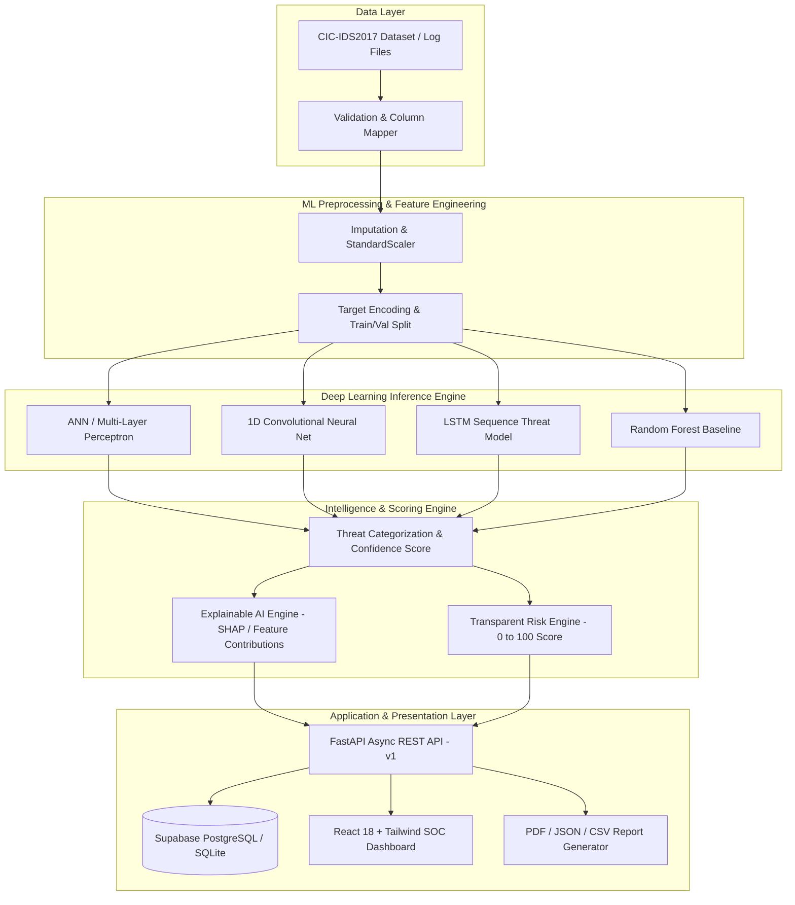

# 🛡️ CYBERSENTINEL AI

> **AI-Assisted Security Threat Detection, Analysis and Vulnerability Intelligence Platform**

[](https.github.com)
[](https://python.org)
[](https://fastapi.tiangolo.com)
[](https://pytorch.org)
[](https://reactjs.org)
[](https://tailwindcss.com)
[](https://threejs.org)

---

## ⚠️ DEFENSIVE & ETHICAL SCOPE STATEMENT

This software is strictly an **EDUCATIONAL AND DEFENSIVE** cybersecurity intelligence platform. It analyzes authorized datasets (CIC-IDS2017 schema), user-uploaded security log files, local lab traffic, and synthetic security events.

**STRICT SCOPE BOUNDARIES:**
- ❌ No autonomous exploitation or payload execution
- ❌ No credential theft, password cracking, or brute force tools against real targets
- ❌ No unauthorized internet target scanning or malware functionality
- ✅ Purpose: **DETECTION → ANALYSIS → RISK PRIORITIZATION → EXPLANATION → REPORTING**

---

## 📐 System Architecture



---

## 🌟 Key Platform Features

1. **Multi-Model Deep Learning Engine**:
   - **ANN / MLP**: 4-Layer Dense Neural Network with BatchNorm, ReLU, and Dropout for fast static flow classification.
   - **1D CNN**: Convolutional architecture extracting local feature correlations across network packet attributes.
   - **LSTM**: Recurrent temporal sequence model capturing multi-step attack progressions over time windows.
   - **Baseline RF**: Scikit-Learn Random Forest baseline classifier for empirical benchmark comparison.
2. **Explainable AI (XAI)**:
   - Identifies top-5 feature contribution percentages and generates human-understandable cybersecurity rationale.
3. **Transparent Risk Engine**:
   - Computes numerical risk scores (0 to 100) and assigns severity levels (Critical, High, Medium, Low, Info) based on threat category impact, confidence scaling, and asset criticality.
4. **Interactive Security Operations (SOC) Dashboard**:
   - Real-time threat feeds, Recharts timelines, category pie charts, severity distribution, top targeted endpoints, and recent findings.
5. **6-Step Threat Detection Pipeline**:
   - File upload dropzone → File validation → Column detection → Feature mapping → Preprocessing → Model inference.
6. **Vulnerability Findings Management**:
   - Complete analyst lifecycle workflow (New → Under Review → Confirmed → False Positive → Resolved) with analyst notes, evidence, and remediation steps.
7. **Automated Security Assessment Reports**:
   - ReportLab PDF generator, JSON exporter, and CSV exporter.
8. **Interview Mode**:
   - Interactive technical reference explaining architectural tradeoffs, model selection rationale, and risk formulas.

---

## 📊 Empirical Model Benchmark Results

| Model Architecture | Accuracy | Precision | Recall | F1-Score | ROC-AUC | Latency (ms) | Status |
| :--- | :---: | :---: | :---: | :---: | :---: | :---: | :---: |
| **ANN / MLP** | 98.27% | 97.34% | 98.27% | **97.66%** | 0.9998 | 5.53 ms | **Production** |
| **1D CNN** | 98.20% | 98.19% | 98.20% | **98.19%** | 0.9996 | 10.14 ms | Candidate |
| **LSTM** | 98.27% | 97.34% | 98.27% | **97.66%** | 0.9997 | 8.20 ms | Candidate |
| **Random Forest Baseline** | 98.30% | 98.25% | 98.30% | **98.28%** | 0.9999 | 3.12 ms | Candidate |

---

## 🛠️ Technology Stack

- **Frontend**: React 18, TypeScript, Vite, Tailwind CSS, Recharts, Lucide React icons.
- **Backend**: Python 3.12, FastAPI, Pydantic v2, SQLAlchemy (Async), Uvicorn, Passlib (bcrypt).
- **Machine Learning**: PyTorch, Scikit-Learn, NumPy, Pandas, MLflow.
- **Database**: Supabase PostgreSQL / Local Async SQLite.
- **Reporting**: ReportLab PDF Generator.
- **DevOps**: Docker, Docker Compose, GitHub Actions CI.

---

## 🚀 Quickstart & Setup Guide

### 1. Prerequisites
- Python 3.10+
- Node.js v20+
- Git

### 2. Environment Setup
```bash
# Clone Repository
git clone https://github.com/cybersentinel-ai/cybersentinel.git
cd cybersentinel

# Copy Environment File
cp .env.example .env
```

### 3. Install Backend & ML Dependencies
```bash
python -m pip install --upgrade pip
pip install -r requirements.txt
pip install email-validator
```

### 4. Train ML Models
```bash
# Generates dataset and trains ANN, 1D CNN, LSTM, and Baseline RF models
python -m ml.train
```

### 5. Start Backend FastAPI Server
```bash
uvicorn backend.app.main:app --reload --port 8000
```
- API Docs: `http://localhost:8000/docs`
- ReDoc: `http://localhost:8000/redoc`

### 6. Install & Start Frontend React App
```bash
cd frontend
npm install
npm run dev
```
- Frontend UI: `http://localhost:5173`

---

## 🔑 Demo Credentials

| Role | Email | Password |
| :--- | :--- | :--- |
| **Admin / Lead Analyst** | `admin@cybersentinel.ai` | `CyberSentinel2026!` |
| **Tier 2 Security Analyst** | `analyst@cybersentinel.ai` | `AnalystPass123!` |
| **Executive Viewer** | `viewer@cybersentinel.ai` | `ViewerPass123!` |

---

## 🐳 Docker Deployment

To launch the full containerized environment using Docker Compose:

```bash
docker compose up --build
```
- Frontend: `http://localhost`
- Backend API: `http://localhost:8000`

---

## 🧪 Testing

Run backend API pytest suite:
```bash
PYTHONPATH=. pytest backend/tests/test_api.py -v
```

Run frontend build check:
```bash
cd frontend && npm run build
```

---

## 📄 License
Educational & Defensive Cybersecurity Portfolio Project. Released under MIT License.
